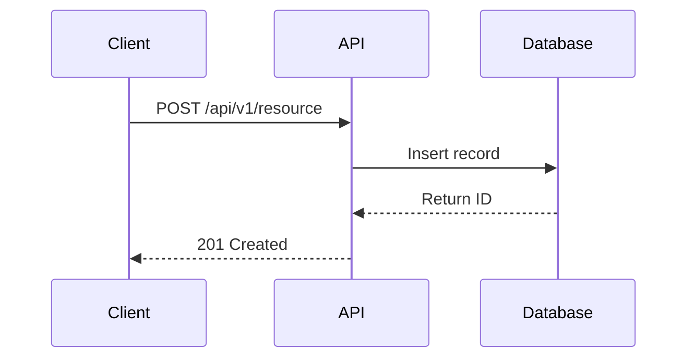

# [Feature Name] API

> Last updated: [DATE] | Task: [TASK_ID]

## Overview

Brief description of what this API does and why it exists.

## Authentication

- Required: Yes/No
- Roles: `participant`, `researcher`, `hcp`, `admin`

## Endpoints

### `POST /api/v1/[resource]`

Create a new [resource].

**Request Body:**
```json
{
  "field1": "string (required) - Description",
  "field2": 123,
  "field3": ["optional", "array"]
}
```

**Response (201 Created):**
```json
{
  "id": 1,
  "field1": "value",
  "created_at": "2026-01-22T10:00:00Z"
}
```

**Errors:**
| Status | Code | Description |
|--------|------|-------------|
| 400 | VALIDATION_ERROR | Invalid input data |
| 401 | UNAUTHORIZED | Missing or invalid token |
| 403 | FORBIDDEN | Insufficient permissions |

---

### `GET /api/v1/[resource]`

List all [resources] with pagination.

**Query Parameters:**
| Param | Type | Default | Description |
|-------|------|---------|-------------|
| skip | int | 0 | Number of records to skip |
| limit | int | 20 | Max records to return |
| search | string | - | Search query |

**Response (200 OK):**
```json
{
  "items": [...],
  "total": 100,
  "skip": 0,
  "limit": 20
}
```

---

### `GET /api/v1/[resource]/{id}`

Get a single [resource] by ID.

**Path Parameters:**
- `id` (int, required): The resource ID

**Response (200 OK):**
```json
{
  "id": 1,
  "field1": "value"
}
```

**Errors:**
| Status | Code | Description |
|--------|------|-------------|
| 404 | NOT_FOUND | Resource not found |

---

### `PUT /api/v1/[resource]/{id}`

Update a [resource].

**Request Body:**
```json
{
  "field1": "new value"
}
```

**Response (200 OK):**
```json
{
  "id": 1,
  "field1": "new value",
  "updated_at": "2026-01-22T10:00:00Z"
}
```

---

### `DELETE /api/v1/[resource]/{id}`

Delete a [resource].

**Response (204 No Content)**

## Workflows

### [Workflow Name]

1. Step one
2. Step two
3. Step three



## Configuration

Environment variables or config needed:
- `CONFIG_VAR`: Description (default: `value`)

## Troubleshooting

### Common Issues

**Problem:** Description of problem
**Solution:** How to fix it

## Related Documentation

- [Link to related doc](./related.md)
- [Database Schema](../database/schema.md)
