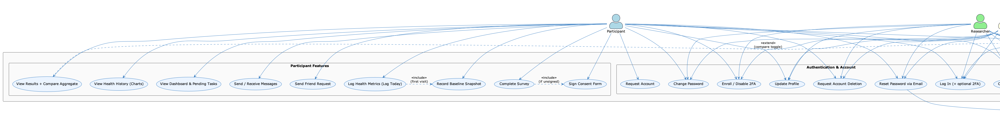
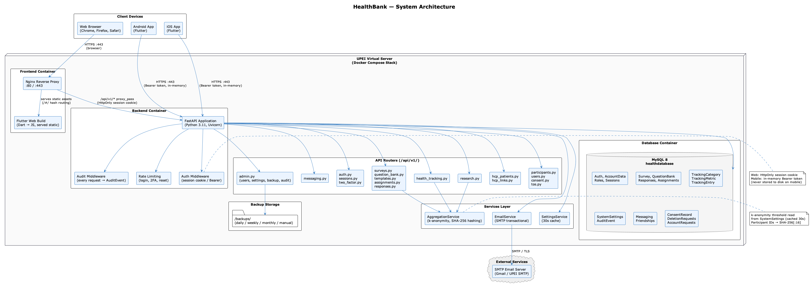
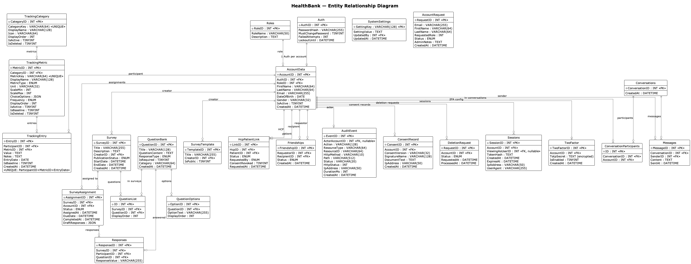
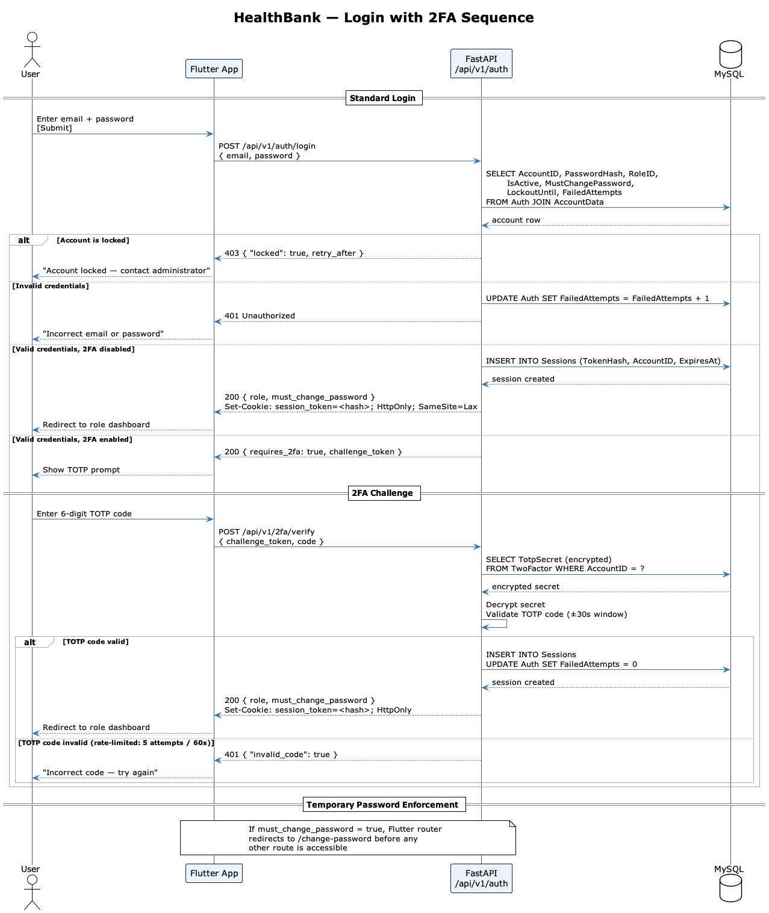
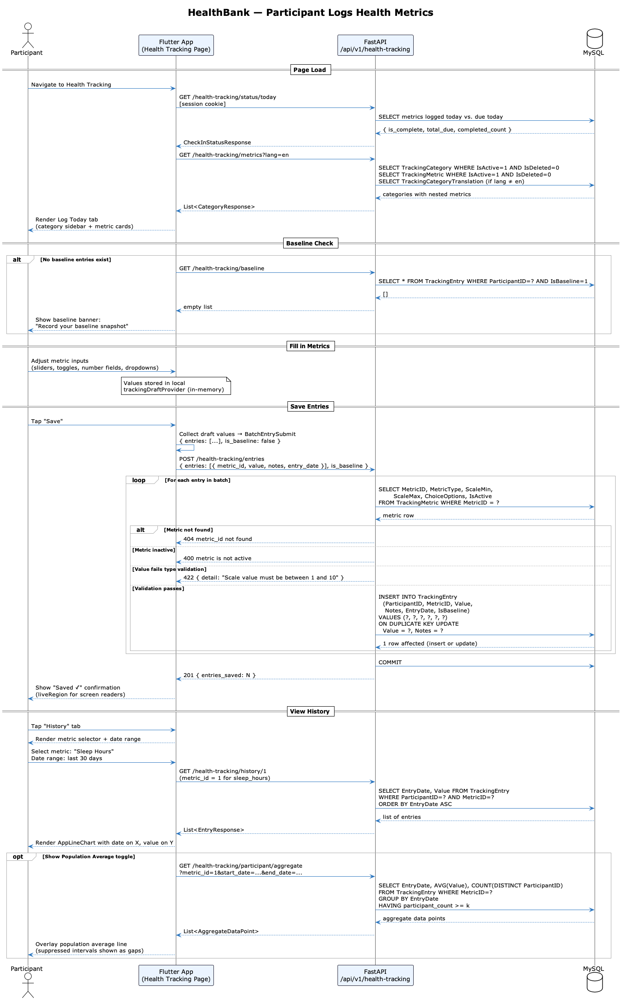
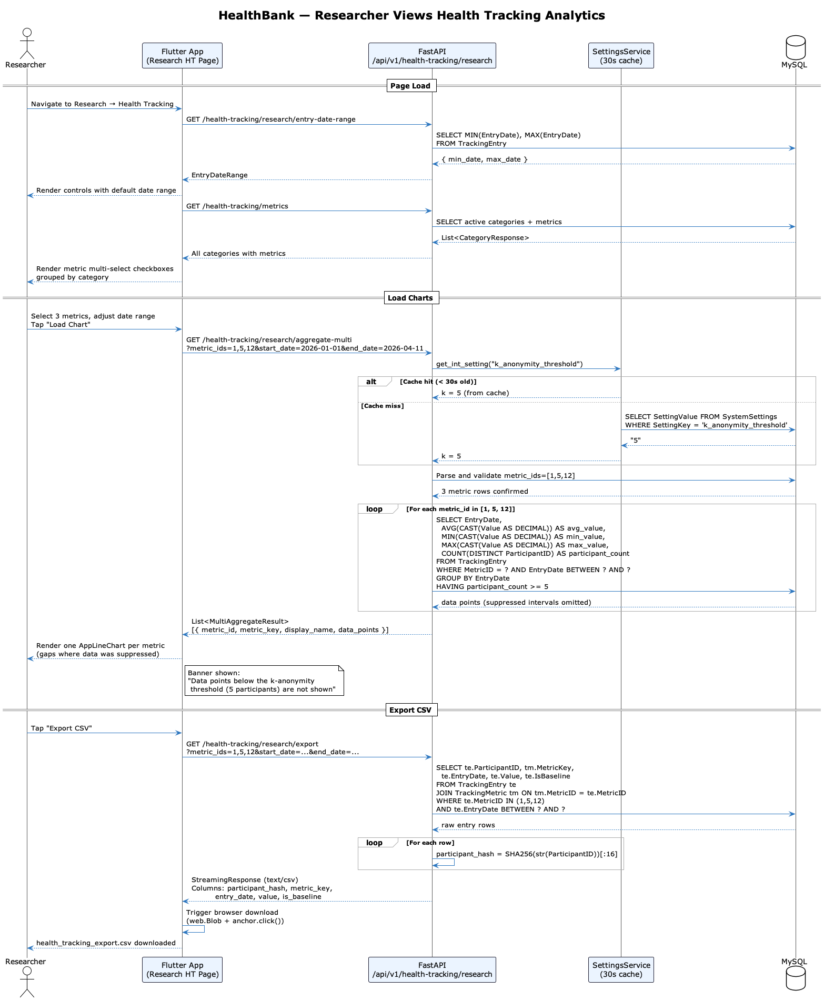
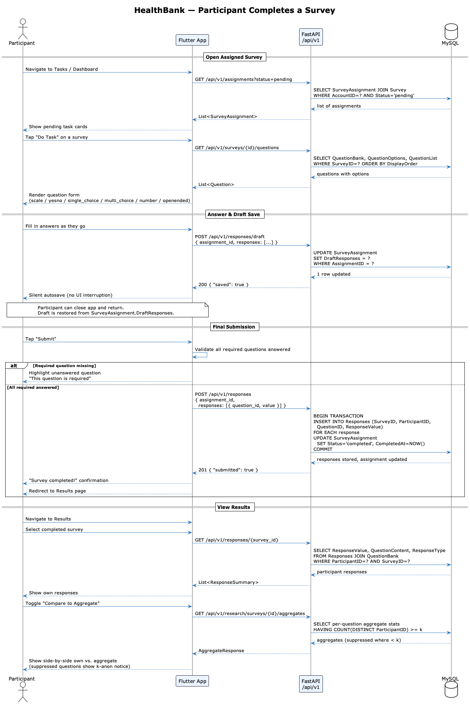
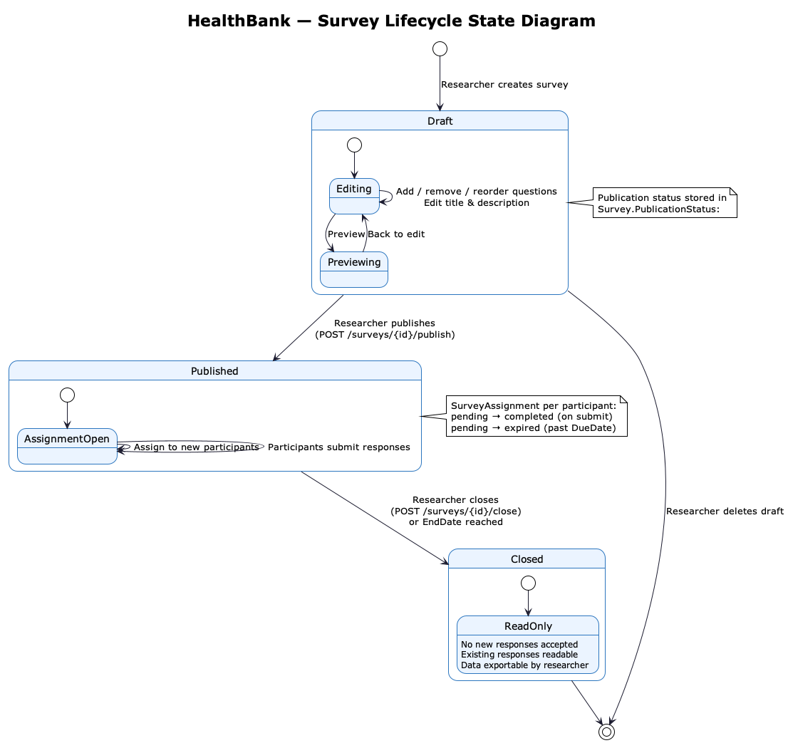
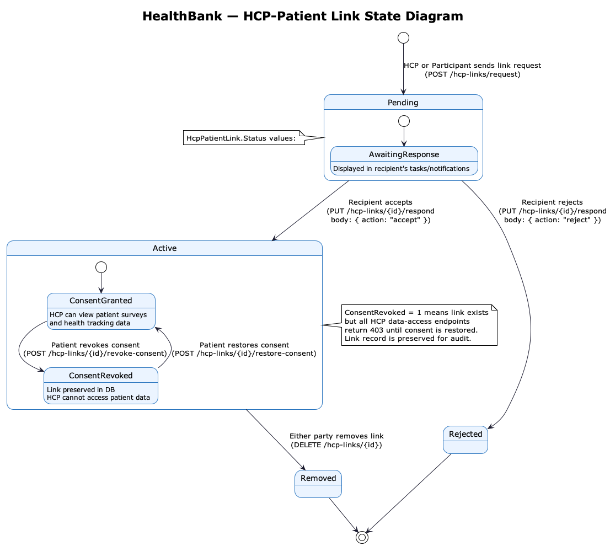
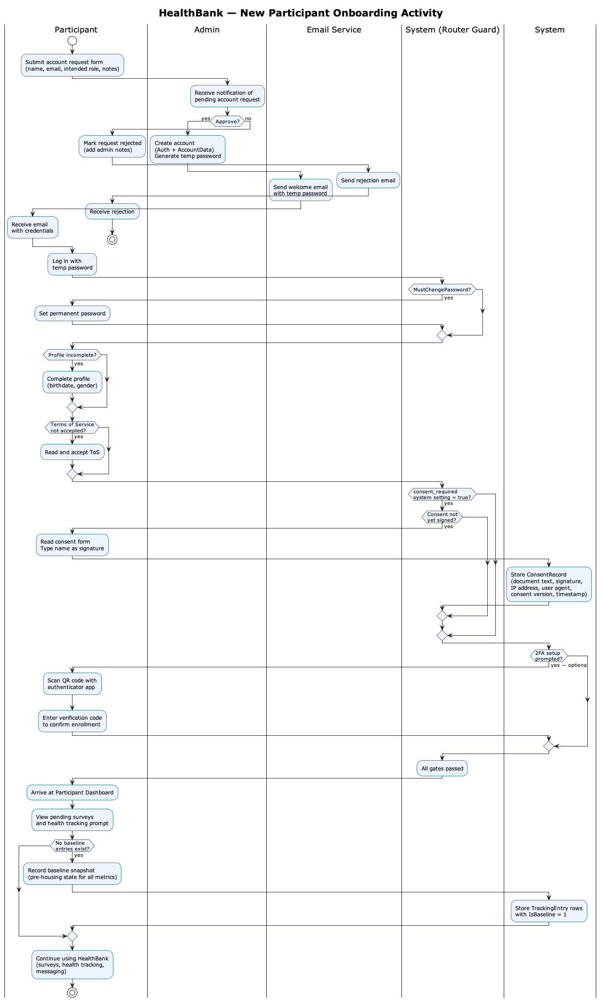

# HealthBank — Researcher Health Data Bank
## Final Project Deliverable

**Adam Joseph Van Omme,**
**Camryn Fairbanks,**
**Robert Bryan-Gilmore,**
**Shaun Lee,**
**Allan Harris,**

CS-4820
Professor David LeBlanc
April 2026

---

# Table of Contents

1. [Vision Statement](#vision-statement)
2. [Statement of Scope](#statement-of-scope)
3. [Project Community](#project-community)
4. [Key Technical and Operational Requirements](#key-technical-and-operational-requirements)
5. [System Acceptance Tests](#system-acceptance-tests)
6. [Use Cases](#use-cases)
   - [System — Account Creation](#account-creation)
   - [System — Login with 2FA](#login-with-2fa)
   - [System — Password Reset via Email](#password-reset)
   - [System — Password Change](#password-change)
   - [System — Profile Data Change](#profile-data-change)
   - [System — 2FA Change](#2fa-change)
   - [System — Audit Log](#audit-log)
   - [Participant — Consent Signing](#consent-signing)
   - [Participant — Answer Surveys](#answer-surveys)
   - [Participant — View Results and Compare to Aggregate](#view-results)
   - [Participant — Track Progress](#track-progress)
   - [Participant — Log and Track Health Metrics](#health-tracking-participant)
   - [Researcher — Create and Publish Surveys](#create-surveys)
   - [Researcher — Pull and Export Data](#pull-data)
   - [Researcher — Health Tracking Analytics](#health-tracking-researcher)
   - [Admin — Approve Account Requests](#approve-requests)
   - [Admin — Manage Users and Data](#manage-users)
   - [Admin — System Settings and Maintenance](#system-settings)
   - [Admin — Manage Health Tracking Configuration](#health-tracking-admin)
   - [HCP — Link to Patient and View Data](#hcp-view-data)
   - [HCP — View Patient Health Tracking Reports](#health-tracking-hcp)
   - [All Roles — In-App Messaging](#messaging)
   - [All Roles — Friend Requests](#friend-requests)
   - [All Roles — Account Deletion Request](#account-deletion)
7. [Feature List](#feature-list)
   - [Front End](#front-end)
   - [Back End](#back-end)
   - [Security](#security)
   - [Integration / APIs](#integration-apis)
   - [Database](#database)
   - [Deployment / Infrastructure](#deployment-infrastructure)
   - [Testing / QA](#testing-qa)
8. [Completed vs. Proposed Feature Comparison](#feature-comparison)
9. [RMMM Plan](#rmmm-plan)
10. [Delivery Plan](#delivery-plan)
11. [System Diagrams](#diagrams)
    - [Use Case Diagram](#use-case-diagram)
    - [System Architecture Diagram](#system-architecture-diagram)
    - [Database Entity Relationship Diagram](#database-entity-relationship-diagram)
    - [Sequence Diagrams](#sequence-diagrams)
    - [State Diagrams](#state-diagrams)
    - [Activity Diagram](#activity-diagram)

---

# Vision Statement {#vision-statement}

The goal of this project is to provide researchers with a secure, accessible interface to collect, store, and analyze health and demographic data from participants. The system supports multiple user roles — participants, researchers, healthcare providers, and administrators — each with a tailored interface and appropriate access controls. Participants can complete surveys, view their own results, and compare them against anonymized aggregate data. Researchers can design surveys, assign them to participants, and export anonymized datasets for analysis. Healthcare providers can access the data of linked, consented patients. Administrators have full oversight of accounts, data, system configuration, and audit activity.

---

# Statement of Scope {#statement-of-scope}

The HealthBank platform is a full-stack web and mobile application for health research data collection and management. It is designed for populations in precarious housing and similar study contexts, where collecting structured health and demographic information over time is a research priority.

The system collects and stores participant-submitted health data through structured surveys. This data is viewable through role-specific dashboards. Participants can view their individual responses and compare them against k-anonymized aggregates of all participants. Researchers can create and manage surveys, view response counts and trends, and export anonymized data as CSV files. Healthcare providers can link to specific patients and view their completed survey data. Administrators manage accounts, review audit logs, configure system settings, and maintain the database.

The backend is implemented in Python using the FastAPI framework, with MySQL for data storage. All API routes are secured using role-based access control. The frontend is built with Flutter, providing a single codebase that runs as a web application and is deployable to Android and iOS. The application is fully containerized using Docker and hosted on UPEI's virtual servers. All components communicate through a documented REST API. The application is available in English, French, and Spanish, and is built to meet WCAG 2.1 AA accessibility standards.

Data is immutable once submitted by participants. Survey responses are retained in accordance with applicable research data retention requirements. All access to the system is logged in a comprehensive audit trail.

---

# Project Community {#project-community}

The client for this project is Dr. Montelpare, School of Medicine at UPEI.

The planning team (CS-4810) consisted of:

- Adam Joseph Van Omme
- Arvin Jiang
- Camryn Fairbanks
- Ethan MacDougall
- Lydia Finkbeiner
- Robert Bryan-Gilmore
- Allan Harris

The development team (CS-4820) consisted of:

- Adam Joseph Van Omme — **Project Lead/Middleware Focus**
- Camryn Fairbanks — **Technical Lead/Backend Developer**
- Robert Bryan-Gilmore — **General Developer/Security Focus**
- Shaun Lee — **General Developer/Frontend Focus**
- Allan Harris — **General Developer/QA Focus**

---

# Key Technical and Operational Requirements {#key-technical-and-operational-requirements}

| Requirement | Technology Used |
|---|---|
| Backend API framework | Python 3.11, FastAPI |
| Database | MySQL 8 |
| Frontend | Flutter 3 (Dart) — web, Android, iOS |
| Containerization | Docker, Docker Compose |
| Version control | Git / GitHub |
| Localization | Flutter gen-l10n (EN, FR, ES) |
| Accessibility standard | WCAG 2.1 AA |
| Authentication | PBKDF2-SHA256 passwords, TOTP 2FA, HttpOnly session cookies |
| Anonymization | K-anonymity (k=5, configurable) with SHA-256 participant ID hashing |
| Email | SMTP-based email service (account creation, password reset, notifications) |
| Deployment | Docker Compose stack on UPEI virtual server, Nginx reverse proxy |

All team members were required to be proficient in or quickly learn Python, Dart/Flutter, MySQL, Docker, and Git. The REST API design follows standard HTTP semantics and is documented well enough for any frontend client — web, mobile, or third-party — to integrate with it.

---

# System Acceptance Tests {#system-acceptance-tests}

The following acceptance tests define the minimum criteria for a successful delivery:

1. The application is accessible as a web application through a consistent, multilingual (EN/FR/ES), and WCAG 2.1 AA-compliant user interface.
2. All users can register, log in with email and password, optionally enable TOTP two-factor authentication, and access their role-appropriate dashboard.
3. Health data is stored securely in a MySQL database with parameterized queries, hashed passwords, and SHA-256 hashed session tokens.
4. Participants can be assigned surveys, save draft responses, submit completed surveys, view their responses, and compare them against k-anonymized aggregate data.
5. Researchers can create surveys with a full question builder, publish them to participants, view response counts and aggregate statistics, and export anonymized data as CSV.
6. Administrators can manage all user accounts, approve or reject registration requests, configure system settings, view the full audit log, and access the database viewer.
7. Healthcare providers can request links to patients, view linked patient survey data, and communicate with patients through in-app messaging.
8. The full audit trail records every meaningful action in the system, accessible and searchable by administrators.
9. The system enforces role-based access control — participants cannot access researcher data, researchers cannot access admin functions, and all role boundaries are enforced at the API level.
10. The application deploys successfully via Docker Compose on UPEI's virtual servers and is reachable from a browser without additional setup.
11. Participants can log health metrics across all active categories, view their history as time-series charts, and record a baseline snapshot capturing their pre-housing state.
12. Researchers can view k-anonymized population-level health tracking trends and export anonymized data as CSV.
13. Administrators can add, edit, reorder, and toggle health tracking categories and metrics without any code changes.

---

# Use Cases {#use-cases}

## System — Account Creation {#account-creation}

**Description**
An administrator creates a new user account, assigns a role, and the system sends the user an email with their temporary credentials.

**Actors:** System Administrator, System, Email Service

**Pre-conditions:**
- Administrator is authenticated and has admin role access
- Database is running and accessible

**Post-conditions:**
- New account exists in the database with the correct role
- User receives an email with their temporary password
- User is required to set a permanent password on first login
- Audit log records the account creation

**Normal Flow:**
1. Administrator navigates to User Management and selects "Add User"
2. Administrator enters the user's name, email, role, and optionally date of birth and gender for participant accounts
3. Administrator sets a temporary password or selects "Send Setup Email" to auto-generate one
4. System validates all inputs, creates the Auth and AccountData records in a single database transaction
5. System sends an account creation email to the new user with their temporary password
6. Audit log entry is created for the new account

**Alternate Flows:**
- If email is already registered: system returns a 409 conflict error and no account is created
- If database write fails: the transaction is rolled back, no partial account is created, and the error is logged

---

## System — Login with 2FA {#login-with-2fa}

**Description**
A user authenticates with their email and password. If two-factor authentication is enabled on their account, they must also complete a TOTP verification step before gaining access.

**Actors:** Any authenticated user, Authentication System, 2FA System

**Pre-conditions:**
- User has a registered account
- If 2FA is enabled, user has access to their authenticator application

**Post-conditions:**
- A session token is issued and stored as an HttpOnly cookie (web) or in-memory token (mobile)
- User is redirected to their role-appropriate dashboard
- Login event is recorded in the audit log

**Normal Flow:**
1. User navigates to the login page and enters their email and password
2. System validates credentials and checks account lockout status
3. If 2FA is enabled, system returns a challenge token and prompts for the TOTP code
4. User enters the 6-digit code from their authenticator app
5. System verifies the code and creates a session
6. User is redirected to their dashboard

**Alternate Flows:**
- If credentials are invalid: failed attempt is counted; after the configured maximum, the account is locked and the user must contact an administrator
- If 2FA code is incorrect: attempt is counted and rate-limited (5 attempts per 60 seconds)
- If user must change their password (temporary password flag set): they are redirected to the change password page before any other action

---

## System — Password Reset via Email {#password-reset}

**Description**
A user who cannot log in because they have forgotten their password requests a reset link by email. The system generates a time-limited token, emails a reset link to the user's registered address, and allows the user to set a new password without knowing their current one.

**Actors:** Any registered user, System, Email Service

**Pre-conditions:**
- User has a registered account with a known email address
- Email service is operational

**Post-conditions:**
- A new password is saved to the database (hashed)
- The reset token is invalidated after use
- User can log in with the new password
- Audit log records the password reset event

**Normal Flow:**
1. User navigates to the login page and selects "Forgot Password"
2. User enters their registered email address and submits the form
3. System looks up the account and generates a cryptographically random reset token with a 1-hour expiry
4. System emails the reset link to the user's registered address
5. User follows the link, which opens the Reset Password page with the token pre-filled
6. User enters and confirms a new password meeting complexity requirements
7. System validates the token (not expired, not already used), hashes and saves the new password, and invalidates the token
8. User is redirected to the login page and can sign in with the new password

**Alternate Flows:**
- If the email is not found: the system shows the same confirmation message (no enumeration of registered emails)
- If the reset token has expired: the user is informed and prompted to request a new link
- If the token has already been used: it is rejected and the user must request a new one
- If the new password does not meet complexity requirements: validation error is shown inline

---

## System — Password Change {#password-change}

**Description**
A user changes their password, either voluntarily through settings or because they were issued a temporary password that must be replaced.

**Actors:** Any authenticated user, System

**Pre-conditions:**
- User is authenticated (or has a valid temporary password session)

**Post-conditions:**
- New password is hashed and stored in the database
- User receives a password change confirmation email
- Audit log records the change

**Normal Flow:**
1. User navigates to Settings and selects "Change Password"
2. User enters their current password and the new password twice
3. System validates the new password meets complexity requirements
4. System hashes and stores the new password
5. System sends a confirmation email and records the event in the audit log

**Alternate Flows:**
- If current password is incorrect: change is rejected
- If new password does not meet requirements: validation error is shown inline

---

## System — Profile Data Change {#profile-data-change}

**Description**
A user updates their profile information, such as their name, date of birth, or gender, through the profile page.

**Actors:** Any authenticated user, System

**Pre-conditions:**
- User is authenticated

**Post-conditions:**
- Updated profile information is saved to the database
- Audit log records the change

**Normal Flow:**
1. User navigates to their Profile page
2. User edits one or more fields (first name, last name, birthdate, gender)
3. System validates inputs and saves the updated values
4. Confirmation is shown and the change is logged

---

## System — 2FA Change {#2fa-change}

**Description**
A user enrolls in, confirms, or disables TOTP two-factor authentication on their account through the Settings page.

**Actors:** Any authenticated user, System, Authenticator Application

**Pre-conditions:**
- User is authenticated
- For enrollment: user has an authenticator application installed

**Post-conditions:**
- 2FA status is updated in the database
- Audit log records the change

**Normal Flow (Enroll):**
1. User navigates to Settings → Two-Factor Authentication
2. System generates a TOTP secret and returns a QR code / provisioning URI
3. User scans the QR code with their authenticator app
4. User enters the 6-digit code to confirm enrollment
5. 2FA is enabled on the account

**Normal Flow (Disable):**
1. User selects "Disable 2FA"
2. System prompts for the current TOTP code to confirm intent
3. System disables 2FA on the account

---

## System — Audit Log {#audit-log}

**Description**
The system automatically records every meaningful user action to a persistent audit log. Administrators can search and filter the log and export it as CSV.

**Actors:** System, Administrator

**Pre-conditions:**
- System is running

**Post-conditions:**
- Action is recorded in the AuditEvent table with actor, IP address, action type, resource, outcome, and timestamp
- Audit log entry is best-effort and does not block the primary request if it fails

**Normal Flow:**
1. Any user performs any action (login, survey submission, data export, settings change, etc.)
2. The audit middleware intercepts the completed request and writes an AuditEvent record
3. The record includes the actor ID, action name, resource type and ID, HTTP status, IP address, user agent, and duration
4. Administrator can navigate to the Audit Log page, filter by action, actor, resource type, status, or date range, and export results to CSV

---

## Participant — Consent Signing {#consent-signing}

**Description**
When consent signing is required (configured by an administrator), a newly registered participant must read and sign the current data collection consent agreement before they can access any other part of the application. If the consent document is updated, all participants must re-sign before continuing.

**Actors:** Participant, System, Administrator

**Pre-conditions:**
- Participant is authenticated
- The `consent_required` system setting is enabled
- Participant has not yet signed the current version of the consent document

**Post-conditions:**
- A consent record is stored in the database with the participant's ID, signature name, IP address, user agent, document text, and timestamp
- Participant is redirected to their dashboard and can access the full application

**Normal Flow:**
1. Participant logs in and is redirected to the Consent page (all other routes are blocked until consent is signed)
2. Participant reads the full consent agreement displayed on the page
3. Participant types their full name as a signature and submits
4. System validates that the name is non-empty and records the consent record in the database, linked to the current consent version
5. Participant is redirected to their dashboard

**Alternate Flows:**
- If `consent_required` is disabled in system settings: consent route redirects to the dashboard and no signing is required
- If participant has previously signed an older version and the consent document has been updated: they are redirected to re-sign before accessing the application
- If submission fails: an error is shown and the participant can retry without losing their place

---

## Participant — Answer Surveys {#answer-surveys}

**Description**
A participant completes and submits a survey that has been assigned to them by a researcher.

**Actors:** Participant, System

**Pre-conditions:**
- Participant is authenticated
- A survey has been assigned to the participant with status "pending"

**Post-conditions:**
- Responses are stored in the Responses table
- Assignment status is updated to "completed"
- Audit log records the submission

**Normal Flow:**
1. Participant navigates to the Surveys page and sees their list of assigned surveys
2. Participant opens a pending survey
3. Participant answers each question (scale, yes/no, multiple choice, open-ended, or numeric)
4. Participant can save a draft at any time and return later
5. Participant submits the completed survey
6. System validates all required questions are answered, stores responses, and marks the assignment complete

**Alternate Flows:**
- If participant saves a draft: responses are stored in the SurveyAssignment draft field and are reloaded on next open
- If a required question is not answered: submission is blocked and the incomplete question is highlighted

---

## Participant — View Results and Compare to Aggregate {#view-results}

**Description**
A participant views their responses to a completed survey and optionally compares their answers to the anonymized aggregate responses from all participants.

**Actors:** Participant, System

**Pre-conditions:**
- Participant has at least one completed survey submission

**Post-conditions:**
- Participant's responses are displayed
- If comparison is enabled, aggregate data is shown alongside — only if the minimum k-anonymity threshold (k=5) is met for each question

**Normal Flow:**
1. Participant navigates to the Results page
2. Participant selects a completed survey from the list
3. System loads the participant's responses and displays them
4. Participant may toggle "Compare to Aggregate" to see anonymized aggregate results alongside their own
5. Participant may toggle "Show Charts" to view responses in visual chart form (automatically enables aggregate comparison)

---

## Participant —  {#track-progress}

**Description**
A participant views their pending tasks, survey completion status, and profile completion status from their dashboard and task list. The dashboard also surfaces quick insights from their most recent completed survey and provides a shortcut to the Health Tracking section.

**Actors:** Participant, System

**Pre-conditions:**
- Participant is authenticated

**Post-conditions:**
- Participant can see all pending surveys, overdue items, and any profile or consent actions required

**Normal Flow:**
1. Participant opens the Dashboard, which displays:
   - A greeting with their name
   - A notification banner if they have unread messages
   - A Quick Insights card showing the most recently completed survey and a "View in Results" shortcut
   - A task progress summary (e.g., "2 of 5 current tasks completed this week")
   - A list of today's pending survey assignments with due times and "Do Task" buttons
   - A "View All Tasks" shortcut to the full task list
2. Participant opens the Tasks page for the full list of pending, overdue, and completed survey assignments
3. System shows alerts for any incomplete profile information (birthdate, gender) or unsigned consent
4. Participant can select any pending item to navigate directly to it

**Alternate Flows**
- If the dashboard fails to load, participant will be unable to do anything and will need to retry at a later date
---

## Participant — Log and Track Health Metrics {#health-tracking-participant}

**Description**
A participant logs daily, weekly, or monthly health and life metrics across up to ten configurable categories (physical health, mental health, nutrition, substance use, housing stability, financial stability, social support, healthcare access, daily functioning, and goals progress). They can view a time-series history chart for any metric and compare their trend against the k-anonymized population average.

**Actors:** Participant, System

**Pre-conditions:**
- Participant is authenticated
- At least one active metric exists in the system (seeded by default; managed by admin)

**Post-conditions:**
- Submitted entries are stored in the TrackingEntry table with the participant ID, metric ID, value, optional notes, and entry date
- Duplicate entries for the same metric and date overwrite the previous value (upsert)

**Normal Flow (Log Today):**
1. Participant navigates to Health Tracking → Log Today tab
2. System displays all active metrics grouped by category, with tabs across the top for each category
3. For each metric, the appropriate input is shown: a slider (scale), a number field (numeric), a toggle (yes/no), a dropdown (single choice), or a text field (open-ended)
4. Participant fills in the metrics they wish to log and taps "Save"
5. System batch-upserts all submitted entries for today's date and shows a confirmation

**Normal Flow (View History):**
1. Participant navigates to Health Tracking → History tab
2. Participant selects a category and a specific metric from the dropdown
3. System displays a line chart of the participant's logged values over the selected date range
4. Participant can adjust the date range and optionally toggle "Show Population Average" to overlay the k-anonymized group trend

**Baseline Snapshot:**
- On first visit, if no baseline entries exist, the participant is shown a banner prompting them to "Record your baseline" — this captures the participant's pre-housing state and stores all entries with `IsBaseline = true` for before/after comparison analysis

**Alternate Flows:**
- If a metric is inactive (disabled by admin): it does not appear on the Log Today tab
- If the participant has no entries for a metric in the selected date range: the chart shows an empty state message

---

## Researcher — Create and Publish Surveys {#create-surveys}

**Description**
A researcher creates a new survey using the survey builder, adds questions from the question bank or creates new ones, and publishes the survey for assignment to participants.

**Actors:** Researcher, Administrator, System

**Pre-conditions:**
- User is authenticated with researcher or admin role

**Post-conditions:**
- Survey is created in the database with status "draft"
- When published, survey is available for assignment to participants

**Normal Flow:**
1. Researcher navigates to Surveys and selects "Create Survey"
2. Researcher enters the survey title and details
3. Researcher adds questions, selecting from the existing question bank or creating new questions
4. For each question, researcher selects the response type (scale, yes/no, multiple choice, open-ended, numeric) and sets whether it is required
5. Researcher previews the survey
6. Researcher publishes the survey, making it available for assignment
7. Researcher assigns the survey to individual participants, all participants, or a demographic-filtered group

**Alternate Flows:**
- Survey can be saved as a draft and edited before publishing
- Researcher can create a survey from an existing template
- A published survey can be closed, after which no further responses are accepted

---

## Researcher — Pull and Export Data {#pull-data}

**Description**
A researcher views anonymized aggregate statistics and individual anonymized response records for a published survey, and optionally exports the data as a CSV file.

**Actors:** Researcher, Administrator, System

**Pre-conditions:**
- User has researcher or admin role
- Survey has received at least k responses (k=5 by default) for aggregate data to be shown

**Post-conditions:**
- Data is displayed in the interface or downloaded as a CSV file
- Participant identities are never revealed — responses are linked to anonymous SHA-256 hashed IDs only

**Normal Flow:**
1. Researcher navigates to the Data page and selects a survey
2. System displays aggregate statistics (counts, percentages, means, distributions) for each question
3. Researcher can switch to individual response rows — each row is identified only by an anonymized participant ID
4. If a question has fewer than k responses, it is suppressed and marked as "insufficient data"
5. Researcher selects "Export CSV" to download the anonymized response data
6. For cross-survey analysis, researcher can use the Data Bank view to select specific questions across multiple surveys

**Alternate Flow:**
- Connection to database fails, and researcher would be unable to access or pull data
- Export to CSV fails, user must retry
---

## Researcher — Health Tracking Analytics {#health-tracking-researcher}

**Description**
A researcher views k-anonymized population-level trends for any configured health tracking metric, filtered by category, date range, and individual metric. Charts show how the participant population is trending over time. Anonymized entry-level data can be exported as CSV for external analysis.

**Actors:** Researcher, Administrator, System

**Pre-conditions:**
- User has researcher or admin role
- At least k participants (default k=5) have submitted entries for a given metric on a given date for aggregate data to be shown

**Post-conditions:**
- Aggregate trend data is displayed in the interface
- Participant identities are never revealed in any output

**Normal Flow:**
1. Researcher navigates to the Health Tracking section of the Research dashboard
2. System displays a filter panel with controls for category, metric, and date range
3. Researcher selects a category (e.g., Mental Health) and a metric (e.g., Mood Score)
4. System displays a line chart of the population average for that metric over the selected date range, with a data-point count per interval
5. If a date interval has fewer than k entries, that interval is suppressed and marked as insufficient data
6. Researcher can export the current filtered dataset as a CSV file containing anonymized (hashed participant ID, metric key, value, date) rows
7. Researcher can navigate to the Category Summary view to see per-category participation counts and average values across all metrics

**Alternate Flows:**
- If no metric is selected: system shows a prompt to select a category and metric
- If all intervals are below the k-anonymity threshold: an insufficient-data state is shown with the threshold indicated

---

## Admin — Approve Account Requests {#approve-requests}

**Description**
When a prospective user submits an account request through the public registration form, an administrator reviews and approves or rejects the request.

**Actors:** Administrator, System, Email Service

**Pre-conditions:**
- A pending account request exists in the system
- Administrator is authenticated

**Post-conditions:**
- On approval: an account is created, a temporary password is generated, and the applicant receives an email with their credentials
- On rejection: the applicant receives a rejection email with any administrator notes
- Audit log records the decision

**Normal Flow:**
1. Administrator navigates to the Account Requests section of the Admin dashboard
2. Administrator reviews the pending request, including the applicant's name, email, role, and any notes
3. Administrator selects "Approve" or "Reject"
4. On approval, the system creates the account, sets a temporary password, and sends the applicant a welcome email
5. The request is removed from the pending queue

**Alternate Flow:**
- Administrator does not have a connection to database, approval fails
- Account creation fails, audit log will flag it
---

## Admin — Manage Users and Data {#manage-users}

**Description**
An administrator manages existing user accounts — creating, editing, deactivating, resetting passwords, and processing account deletion requests.

**Actors:** Administrator, System

**Pre-conditions:**
- Administrator is authenticated

**Post-conditions:**
- Changes are applied to the database
- All actions are recorded in the audit log

**Normal Flow:**
1. Administrator navigates to User Management
2. Administrator can search, filter, and sort the full user list
3. Administrator selects a user to view their details and perform actions:
   - Edit name, email, role, or active status
   - Reset the user's password (generates a new temporary password)
   - Send a password reset email
   - View as the user (impersonation mode for support purposes)
   - Deactivate or reactivate the account
4. For account deletion requests, administrator navigates to the Deletion Queue and approves or rejects each pending request
5. On approved deletion, the user's personally identifiable data is anonymized and their account is removed

**Alternate Flow:**
- Administrator is unable to view users, check connection
- New password is unable to be generated, Administrator will have to create temporary password on behalf of the user
---

## Admin — System Settings and Maintenance {#system-settings}

**Description**
An administrator configures system-wide operational settings and uses the database viewer and backup tools for system maintenance.

**Actors:** Administrator, System

**Pre-conditions:**
- Administrator is authenticated

**Post-conditions:**
- Settings are saved and take effect immediately (cached settings are invalidated on save)
- All setting changes are recorded in the audit log

**Normal Flow:**
1. Administrator navigates to Settings
2. Administrator can configure:
   - K-anonymity threshold (minimum respondents required before aggregate data is shown)
   - Whether self-registration is open or closed
   - Maintenance mode (shows a banner to all users with a configurable message and expected completion time)
   - Whether consent signing is required for new users
   - Maximum failed login attempts before lockout
   - Lockout duration in minutes
3. Administrator can use the Database Viewer to browse all tables, view schema, and inspect data
4. Administrator can trigger database backups and download or delete existing backup files

**Alternate Flow:**
- Settings fail to take effect, ensure that the Administrator has pressed "save options" at the bottom and retry
- Database viewer fails, user should check their connection
---

## Admin — Manage Health Tracking Configuration {#health-tracking-admin}

**Description**
An administrator creates, edits, reorders, and activates or deactivates the metric categories and individual metrics that participants see on the Health Tracking page. This allows the research team to adapt the tracking instrument over time without any code changes.

**Actors:** Administrator, System

**Pre-conditions:**
- Administrator is authenticated

**Post-conditions:**
- Category and metric changes are reflected immediately on the participant Health Tracking page
- All changes are recorded in the audit log

**Normal Flow:**
1. Administrator navigates to Admin → Health Tracking Settings
2. System displays all tracking categories in display order, each expandable to show its metrics
3. Administrator can:
   - Add a new category (name, key, icon, display order, translations for FR and ES)
   - Edit an existing category's name, description, icon, or display order
   - Toggle a category active or inactive (inactive categories and all their metrics are hidden from participants)
   - Add a new metric under a category (name, key, type, unit, scale range, choice options, frequency, translations)
   - Edit an existing metric's display name, description, or settings
   - Toggle an individual metric active or inactive
   - Reorder metrics within a category using up/down controls (WCAG 2.5.7 keyboard-accessible)
4. Changes take effect immediately — the next time a participant opens Health Tracking, the updated configuration is served

**Alternate Flows:**
- If a deactivated metric has existing participant entries: entries are retained; the metric simply no longer appears for new logging
- If a metric key already exists: the system rejects the duplicate with a 409 conflict error

---

## HCP — Link to Patient and View Data {#hcp-view-data}

**Description**
A healthcare provider requests a data-sharing link with a patient, and once the patient accepts, the HCP can view the patient's completed survey responses.

**Actors:** Healthcare Provider, Participant, System

**Pre-conditions:**
- Healthcare provider is authenticated with HCP role
- Patient is a registered participant in the system

**Post-conditions:**
- Link is established (pending patient acceptance)
- Once active, HCP can view patient's survey responses

**Normal Flow:**
1. Healthcare provider navigates to the Clients page and selects "Request Link"
2. HCP enters the patient's email address to send a link request
3. Patient receives the request in their Tasks/Messages view and accepts or rejects it
4. On acceptance, the link becomes active and the HCP can view the patient's completed surveys
5. Patient can revoke the HCP's data access at any time without removing the link
6. Either party can permanently remove the link

**Alternate Flow:**
- HCP is unable to connect to database, retry connection
- HCP is unable to link with participant, ensure entered information is correct and retry
---

## HCP — View Patient Health Tracking Reports {#health-tracking-hcp}

**Description**
A healthcare provider views the health tracking history of a linked, consented patient. Reports are presented in a dedicated Health Tracking tab on the HCP Reports page, showing per-metric time-series charts and the most recent values for each category.

**Actors:** Healthcare Provider, System

**Pre-conditions:**
- HCP is authenticated with HCP role
- An active data-sharing link exists between the HCP and the patient
- Patient has not revoked the HCP's data access

**Post-conditions:**
- Patient health tracking data is displayed to the HCP (read-only)
- No health tracking data is visible if the patient has revoked consent

**Normal Flow:**
1. HCP navigates to Clients and selects an active linked patient
2. HCP selects the Reports tab and then the Health Tracking sub-tab
3. System loads the patient's tracking entries and displays a category-by-category summary:
   - Most recent logged value for each active metric
   - A line chart of the metric's history for the selected date range
4. HCP can adjust the date range and filter by category
5. HCP can switch to the Survey Reports sub-tab to view the patient's completed survey responses in the same Reports view

**Alternate Flows:**
- If the patient has no health tracking entries: an empty state is shown per metric
- If the patient has revoked data access: the Reports tab is blocked and a message indicates that access has been revoked

---

## All Roles — In-App Messaging {#messaging}

**Description**
Users can send and receive direct messages within the application, subject to role-based permission rules governing who may contact whom.

**Actors:** Any authenticated user, System

**Pre-conditions:**
- Both parties are authenticated and have accounts in the system

**Post-conditions:**
- Messages are stored in the database and visible in both parties' inboxes

**Permission Rules:**
- Participants can message their linked HCPs and accepted friends
- Healthcare providers can message their active, consented linked patients
- Researchers can message other researchers
- Administrators can message anyone

**Normal Flow:**
1. User navigates to Messages and selects a conversation or starts a new one
2. User types and sends a message
3. Message is stored and immediately visible in the conversation view
4. Recipient sees the message in their inbox on next visit

**Alternate Flow:**
- Messages system fails to load, user should check connection with server
- Message fails to send, user shoudl check connection with server
---

## All Roles — Friend Requests {#friend-requests}

**Description**
Participants can send friend requests to other participants by entering their email address. Once a request is accepted, the two participants can message each other directly. Pending requests are surfaced in the participant's notification count and can be accepted or declined from the Friends page.

**Actors:** Participant (sender), Participant (recipient), System

**Pre-conditions:**
- Both users are authenticated participants
- Recipient email address is registered and belongs to a participant account

**Post-conditions:**
- On acceptance: a friendship is established and both participants can message each other
- On rejection: the request is removed with no further action

**Normal Flow:**
1. Participant navigates to Messages → Friends
2. Participant selects "Add Friend" and enters the recipient's email address
3. System looks up the participant by email and creates a pending friend request
4. Recipient sees the pending request in their notification count and Friends page
5. Recipient accepts or declines the request
6. On acceptance, both participants appear in each other's messaging contacts

**Alternate Flows:**
- If the email is not found or does not belong to a participant: an error is shown and no request is created
- If a request already exists between the two users: the system shows a message indicating the request is pending or already connected
- Participant can withdraw an outgoing request at any time before it is accepted

---

## All Roles — Account Deletion Request {#account-deletion}

**Description**
Any authenticated user can submit a request to have their account and personal data permanently deleted. The request is queued for administrator review. On approval, the user's personally identifiable information is anonymized in the database. On rejection, the user is notified and their account remains active.

**Actors:** Any authenticated user, Administrator, System, Email Service

**Pre-conditions:**
- User is authenticated

**Post-conditions:**
- A deletion request record is created in the DeletionRequests queue
- On approval: PII is anonymized, account is deactivated, and user receives a confirmation email
- On rejection: user receives a rejection notification and the account remains unchanged
- Audit log records both the request and the administrative decision

**Normal Flow:**
1. User navigates to Settings and selects "Request Account Deletion"
2. User confirms the request (system explains that this will permanently remove their personal data)
3. System creates a pending deletion request in the admin queue
4. Administrator navigates to Admin → Deletion Queue, reviews the request, and approves or rejects it
5. On approval: the system anonymizes the user's name, email, and other PII fields, deactivates the account, sends a confirmation email, and records the event in the audit log
6. On rejection: the administrator adds optional notes, the request is closed, and the account remains active

**Alternate Flows:**
- If the user already has a pending deletion request: they are informed and cannot submit a duplicate
- If the user is an administrator: a safeguard prevents the last admin account from being deleted

---

# Feature List {#feature-list}

## Front End {#front-end}

### Authentication and Onboarding Pages

**Description:** A complete set of authentication screens covering login with optional 2FA challenge, forgot password, email-based password reset, first-login password change, and initial profile completion for new participants. Each screen enforces validation, provides clear feedback, and handles all error states gracefully.
**Priority:** 1
**Delivered:** Yes
**Acceptance Criteria:** All authentication flows complete without error, redirect correctly based on role, and enforce the temporary-password change requirement before any other action is accessible.

---

### Account Request and Consent Flow

**Description:** A public account request form allows prospective users to apply for access. Once approved and logged in, new users are guided through password setup, optional 2FA enrollment, consent signing (when required by system settings), and profile completion before reaching their dashboard.
**Priority:** 1
**Delivered:** Yes
**Acceptance Criteria:** Account request is submitted and stored, admin receives the request in the queue, approval creates the account and sends credentials via email, and all onboarding steps are enforced in the correct order.

---

### Role-Based Dashboards

**Description:** Each user role has a dedicated dashboard showing relevant at-a-glance information. Participants see pending surveys and recent activity. Researchers see survey response counts and data access. HCPs see their linked patients. Administrators see system-wide statistics, pending account requests, and pending deletion requests.
**Priority:** 1
**Delivered:** Yes
**Acceptance Criteria:** Each role sees only the dashboard appropriate to their account. All dashboard data loads correctly from the backend.

---

### Participant Survey Taking

**Description:** Participants are assigned surveys and complete them through a step-by-step form interface. The form supports scale sliders, yes/no toggles, single and multiple choice selectors, numeric inputs, and open-ended text fields. Responses are automatically saved as a draft so the participant can return and continue without losing progress.
**Priority:** 1
**Delivered:** Yes
**Acceptance Criteria:** All question types render and capture input correctly. Draft saving works across sessions. Required question validation prevents submission until all required fields are complete. Submitted responses are stored in the database.

---

### Participant Results and Aggregate Comparison

**Description:** Participants can view their responses to any completed survey. They can toggle aggregate comparison to see their answers alongside anonymized group statistics, and toggle chart view to see data visualized. When both toggles are active, charts and comparison are shown together.
**Priority:** 2
**Delivered:** Yes
**Acceptance Criteria:** Individual responses are displayed accurately. Aggregate comparison only appears when the k-anonymity threshold is met. Chart and comparison toggles function independently, with Charts automatically enabling Comparison.

---

### Researcher Survey Builder

**Description:** Researchers use a full survey creation interface to build surveys from scratch or from saved templates. They can add questions from the question bank, create new questions of any type, set required/optional status, reorder questions, preview the survey, and publish it when ready.
**Priority:** 1
**Delivered:** Yes
**Acceptance Criteria:** Surveys can be created, saved as drafts, previewed, published, and closed. All question types are supported. Templates can be created from existing surveys and reused.

---

### Researcher Data Analysis and Export

**Description:** Researchers can view per-survey aggregate statistics, browse individual anonymized response rows, apply filters, and download the full anonymized dataset as a CSV file. A cross-survey Data Bank view allows researchers to select specific questions across multiple surveys for combined analysis.
**Priority:** 1
**Delivered:** Yes
**Acceptance Criteria:** Aggregate data is correctly computed and suppressed when below the k-anonymity threshold. CSV export produces a complete, correct, anonymized file. Cross-survey view correctly combines data from multiple surveys.

---

### HCP Patient Management and Data Access

**Description:** Healthcare providers can request links to patients by email, view all active links and pending requests, and access the survey history and individual responses of their consented linked patients. Patients can revoke or restore HCP data access at any time.
**Priority:** 2
**Delivered:** Yes
**Acceptance Criteria:** Link requests are received by patients and can be accepted or rejected. Active links allow HCPs to view patient survey data. Consent revocation immediately blocks HCP data access without removing the link.

---

### Admin User Management Interface

**Description:** Administrators can view, search, sort, and filter all user accounts, create new accounts, edit user details and roles, reset passwords, send password reset emails, toggle active/inactive status, and process account deletion requests. The impersonation (view-as) feature allows administrators to view the application as any user for support purposes.
**Priority:** 1
**Delivered:** Yes
**Acceptance Criteria:** All CRUD operations on users work correctly. View-as mode loads the correct role-specific view. Deletion requests are processed and PII is properly anonymized on approval.

---

### Admin Settings, Audit Log, and Database Viewer

**Description:** Administrators configure system-wide settings, view and search the full audit log with CSV export, and use the database viewer to inspect any table's schema and data directly.
**Priority:** 2
**Delivered:** Yes
**Acceptance Criteria:** Settings are saved and take effect without requiring a restart. Audit log is searchable and filterable. Database viewer shows accurate, current table data.

---

### Participant Health Tracking

**Description:** Participants log daily, weekly, and monthly health and life metrics across ten admin-configurable categories. The Log Today tab shows category tabs with the appropriate input widget for each metric type (slider, number field, toggle, dropdown, or text field). The History tab shows a time-series line chart for any selected metric, with an optional population-average overlay. A baseline snapshot banner prompts first-time users to record their pre-housing state.
**Priority:** 2
**Delivered:** Yes
**Acceptance Criteria:** All five metric input types render and save correctly. Batch upsert works for same-day re-submissions. History chart displays the correct date range. Population-average overlay respects the k-anonymity threshold.

---

### Researcher Health Tracking Analytics

**Description:** Researchers access a health tracking analytics panel with a category/metric/date-range filter and a per-metric line chart of k-anonymized population averages. Suppression is enforced per interval when fewer than k entries exist. Anonymized entry data can be exported as CSV.
**Priority:** 2
**Delivered:** Yes
**Acceptance Criteria:** Charts display correct aggregate values. Intervals below the k-anonymity threshold are suppressed. CSV export produces a correct, anonymized output.

---

### HCP Health Tracking Reports

**Description:** Healthcare providers can view a linked patient's health tracking history in the Reports section of the Clients page. A dedicated Health Tracking sub-tab shows per-metric trend charts and most-recent values, gated behind active HCP-patient link and consent status.
**Priority:** 2
**Delivered:** Yes
**Acceptance Criteria:** Health tracking data is visible only for active, consented links. Revoked consent immediately blocks the tab. Charts display accurate patient data.

---

### Admin Health Tracking Settings

**Description:** Administrators manage the full tracking configuration through a dedicated settings page: create/edit/toggle/reorder categories and metrics, set metric types (scale/number/yesno/single_choice/text), frequencies, units, and translations (EN/FR/ES). Changes take effect immediately for all participants.
**Priority:** 2
**Delivered:** Yes
**Acceptance Criteria:** CRUD operations on categories and metrics persist correctly. Toggling a category inactive hides all its metrics from participants. Reorder controls update display order in the database.

---

### In-App Messaging

**Description:** All user roles can send and receive direct messages within the application, subject to role-based access rules. Participants can message their HCPs and accepted friends. HCPs can message consented linked patients. Researchers can message other researchers. Admins can message anyone.
**Priority:** 3 (originally a stretch goal — delivered)
**Delivered:** Yes
**Acceptance Criteria:** Conversations are created correctly, messages are stored and displayed in order, and permission rules are enforced at the API level.

---

### Profile and Settings Pages

**Description:** All users have a profile page to view and update their personal information. The settings page provides access to 2FA enrollment/disable, password change, appearance preferences (light/dark mode), and self-service account deletion request.
**Priority:** 2
**Delivered:** Yes
**Acceptance Criteria:** All profile edits are saved correctly. 2FA enrollment and disabling work end-to-end. Account deletion request is submitted to the admin queue.

---

### Multilingual Support (EN / FR / ES)

**Description:** The entire user interface is available in English, French, and Spanish. All user-facing strings are externalized to ARB localization files. Users can switch languages at any time. All three languages are complete with no hardcoded English strings in the UI.
**Priority:** 2
**Delivered:** Yes
**Acceptance Criteria:** Switching language updates all visible text. No hardcoded English strings appear in non-English modes. All three ARB files are complete and consistent.

---

### Accessibility (WCAG 2.1 AA)

**Description:** The application meets WCAG 2.1 AA accessibility standards throughout. All form fields have semantic labels, icon buttons have tooltips, interactive elements are keyboard-accessible, status updates use live regions, and decorative elements are hidden from screen readers.
**Priority:** 2
**Delivered:** Yes
**Acceptance Criteria:** All new screens and widgets pass WCAG 2.1 AA review using the defined checklist. Screen reader navigation is functional on all primary flows.

---

### Responsive Layout (Web and Mobile)

**Description:** The Flutter application adapts its layout to different screen sizes. Navigation collapses to a bottom navigation bar on mobile, content reflows for narrow screens, and all primary flows are usable on both desktop and mobile browsers.
**Priority:** 3 (originally a stretch goal — delivered)
**Delivered:** Yes
**Acceptance Criteria:** Application is usable on mobile and desktop screen sizes without layout overflow or broken navigation.

---

### Public Pages

**Description:** A set of public pages accessible without login: Home landing page, About, Help, Contact, Privacy Policy, and Terms of Service. Terms of Service requires a one-time acceptance from authenticated users before they can access the full application.
**Priority:** 3
**Delivered:** Yes
**Acceptance Criteria:** All public pages load without authentication. Terms of Service acceptance is enforced for new users and recorded in the database.

---

## Back End {#back-end}

### Authentication and Session Management API

**Description:** The authentication API handles user login (with optional 2FA challenge), session creation, session validation, and logout. Sessions are identified by cryptographically random tokens, hashed with SHA-256 before database storage, and delivered as HttpOnly cookies on web or in-memory tokens on mobile. Session expiry is enforced on every request.
**Priority:** 1
**Delivered:** Yes
**Acceptance Criteria:** Login creates a valid session. Logout invalidates it. Expired or invalid sessions return 401. Sessions are never stored in plaintext.

---

### Two-Factor Authentication (TOTP) API

**Description:** The 2FA API supports TOTP enrollment (generating a QR code and provisioning URI), confirmation (verifying the first code to activate 2FA), challenge verification during login, and disabling 2FA. TOTP secrets are encrypted before storage using a master key. All 2FA endpoints are rate-limited.
**Priority:** 1
**Delivered:** Yes
**Acceptance Criteria:** TOTP enrollment, confirmation, and login challenge all work end-to-end with standard authenticator apps. Rate limiting prevents brute-force code guessing.

---

### User and Account Lifecycle API

**Description:** Covers the full account lifecycle: admin-initiated account creation with temporary password, public account request submission, admin approval and rejection workflows, profile updates, password change, forgot-password email reset, and admin-managed account deletion with PII anonymization on approval.
**Priority:** 1
**Delivered:** Yes
**Acceptance Criteria:** All account state transitions work correctly, trigger the appropriate emails, and are recorded in the audit log. Failed account creation rolls back the database transaction completely.

---

### Survey Management API

**Description:** Full CRUD for surveys, questions, question options, templates, and survey assignments. Supports all question types (scale, yes/no, single choice, multiple choice, numeric, open-ended), draft saving, survey publishing and closing, and assignment by individual user, all participants, or demographic filter.
**Priority:** 1
**Delivered:** Yes
**Acceptance Criteria:** Surveys can be created, edited, published, and closed. All question types store and retrieve correctly. Assignments are created and update status on completion.

---

### K-Anonymous Aggregation Engine

**Description:** The aggregation service computes summary statistics (counts, percentages, means, distributions, most common values) for each response type, suppressing any question where the number of distinct respondents falls below the configured k-anonymity threshold (default k=5). Participant IDs are replaced with SHA-256 hashes in all researcher-facing outputs. Supports both per-survey and cross-survey aggregation.
**Priority:** 1
**Delivered:** Yes
**Acceptance Criteria:** Aggregates are computed correctly for all response types. Questions below the threshold are suppressed. Individual participants are never identifiable from researcher outputs.

---

### HCP Patient Linking API

**Description:** Manages the lifecycle of HCP-patient data-sharing links: creation by email lookup, patient accept/reject, consent revocation and restoration, and link removal by either party. Data access for HCPs is gated at the API level on link status and consent state.
**Priority:** 2
**Delivered:** Yes
**Acceptance Criteria:** Links transition through states (pending → active → removed/revoked) correctly. HCPs cannot access patient data without an active, consented link. Revocation takes effect immediately.

---

### In-App Messaging API

**Description:** Handles direct conversations between users with role-based permission enforcement. Supports conversation creation, message retrieval, and message sending. Includes friend request functionality for participant-to-participant connections.
**Priority:** 3 (originally a stretch goal — delivered)
**Delivered:** Yes
**Acceptance Criteria:** Messages are stored correctly and retrieved in order. Permission rules are enforced (e.g., HCP can only message consented patients). Friend requests can be sent, accepted, and rejected.

---

### Health Tracking API

**Description:** A dedicated router (`/api/v1/health-tracking`) covers three access tiers. Participant endpoints allow fetching active metrics grouped by category (with translations), batch-upserting entries for a given date, retrieving own entries filtered by date range and category, viewing time-series history for charting, and retrieving baseline snapshot entries. Admin endpoints provide full CRUD for categories and metrics, including active/inactive toggling and batch reordering. Researcher endpoints return k-anonymized aggregate trends per metric, anonymized CSV export, and a category-level participation summary.
**Priority:** 2
**Delivered:** Yes
**Acceptance Criteria:** Participant entry upsert correctly handles same-metric same-date updates. Admin CRUD operations persist correctly and are reflected immediately. Researcher aggregate endpoints enforce k-anonymity suppression per date interval.

---

### Consent Management API

**Description:** Tracks participant consent to data collection. Returns whether the current user has signed the current consent version. Accepts signed consent submissions including the full document text, signature name, IP address, and user agent. Consent checking respects the `consent_required` system setting — when disabled, all users are treated as having consented.
**Priority:** 2
**Delivered:** Yes
**Acceptance Criteria:** Consent status is correctly returned based on the signed version vs. the current required version. When `consent_required` is false, no user is redirected to the consent flow.

---

### Admin and System Settings API

**Description:** Provides all admin-only endpoints: user management (CRUD, password reset, impersonation), system settings (get and update all configurable parameters), audit log access with filtering and CSV export, database viewer, database backup management, account request queue, and deletion request queue.
**Priority:** 1
**Delivered:** Yes
**Acceptance Criteria:** All admin endpoints are accessible only to admin role. Settings changes are applied immediately. Audit log queries return accurate, filterable results.

---

## Security {#security}

### Password Security

**Description:** All passwords are hashed using PBKDF2-SHA256 before storage. Password complexity is enforced on creation and change. A `MustChangePassword` flag forces users with temporary passwords to set a permanent one before accessing any other part of the application.
**Priority:** 1
**Delivered:** Yes
**Acceptance Criteria:** No plaintext passwords exist in the database. Temporary password flag redirects user to change password on every entry point.

---

### Session Security

**Description:** Session tokens are generated using `os.urandom(32)` (cryptographically secure), hashed with SHA-256 before database storage, and delivered as HttpOnly cookies on web clients. Mobile clients hold tokens in memory only. Sessions expire after a configurable period and are invalidated on logout.
**Priority:** 1
**Delivered:** Yes
**Acceptance Criteria:** Session tokens are never stored in plaintext. Expired sessions return 401. Logout invalidates the session immediately.

---

### Role-Based Access Control

**Description:** Every API router and individual endpoint enforces role requirements via a `require_role()` FastAPI dependency. The role hierarchy (participant < researcher < HCP < admin) is enforced at the database query level as well, with the current user's effective role always derived from the authenticated session, never from request body parameters.
**Priority:** 1
**Delivered:** Yes
**Acceptance Criteria:** A participant cannot call researcher or admin endpoints. A researcher cannot call admin endpoints. Role checks cannot be bypassed by passing a different account ID in the request.

---

### Input Sanitization and SQL Injection Prevention

**Description:** All SQL queries use parameterized placeholders (`%s`) exclusively — no f-string or string-format interpolation is used in any `cursor.execute` call. All user-supplied text inputs that reach the database are processed through the `sanitized_string()` validator in the Pydantic model layer.
**Priority:** 1
**Delivered:** Yes
**Acceptance Criteria:** No SQL injection vector exists in any database-touching code path. All user text inputs are sanitized before storage.

---

### Rate Limiting and Account Lockout

**Description:** Sensitive endpoints (login, password reset, 2FA verification) are rate-limited by IP and/or account using configurable rules. Login failures are counted per account and the account is locked after the administrator-configured maximum, requiring an admin reset.
**Priority:** 2
**Delivered:** Yes
**Acceptance Criteria:** Login endpoint limits attempts per IP. Account lockout is triggered after the configured number of failures. 2FA endpoints have independent rate limits.

---

### Audit Logging Middleware

**Description:** A FastAPI middleware layer intercepts every completed request and writes a structured audit event to the database. Each event captures the actor, action type, resource type and ID, outcome (success/failure/denied), HTTP status, IP address, user agent, and duration. Logging is best-effort and does not interrupt the primary request on failure.
**Priority:** 2
**Delivered:** Yes
**Acceptance Criteria:** All significant actions (login, logout, data access, survey submission, settings changes, admin actions) are present in the audit log with correct metadata.

---

## Integration / APIs {#integration-apis}

### REST API Framework (FastAPI)

**Description:** The entire backend is built on FastAPI with Pydantic v2 for request/response validation. API follows REST conventions with correct HTTP status codes, consistent error response format, and clean endpoint design. All routes are organized into versioned routers mounted under `/api/v1/`.
**Priority:** 1
**Delivered:** Yes
**Acceptance Criteria:** All API routes are documented, return correct HTTP status codes, and produce consistent error responses.

---

### Email Service Integration

**Description:** An SMTP-based email service sends transactional emails for: new account creation (with temporary password), password reset link, password change confirmation, 2FA enrollment confirmation, account request approval, account request rejection, and account deletion confirmation.
**Priority:** 2
**Delivered:** Yes
**Acceptance Criteria:** All defined email types send correctly with appropriate content. Email failures are logged but do not cause the originating request to fail.

---

## Database {#database}

### Schema Design and Core Tables

**Description:** The MySQL database schema covers the full application domain: account authentication and roles, user profiles, sessions, 2FA secrets, surveys and questions with multi-language translation support, survey assignments and responses, consent records, HCP-patient links, messaging, system settings, audit events, database backups, account lifecycle (requests, deletion requests), and health tracking (TrackingCategory, TrackingMetric, TrackingEntry, and optional translation tables for categories and metrics).
**Priority:** 1
**Delivered:** Yes
**Acceptance Criteria:** All application features are backed by correct, normalized table structures with appropriate foreign key constraints and indexes.

---

### Database Backup and Restore

**Description:** Administrators can trigger manual database backups through the admin interface. Backup files are stored on the server and can be listed, downloaded, and deleted through the API. The system also supports scheduled automatic backups.
**Priority:** 3
**Delivered:** Yes
**Acceptance Criteria:** Manual backup can be triggered from the admin interface. Backup files are listed and downloadable. Old backups can be deleted.

---

### System Settings Store

**Description:** A `SystemSettings` table stores all configurable application parameters with a caching layer (30-second TTL) to minimize database reads. The cache is explicitly invalidated when settings are updated by an administrator.
**Priority:** 2
**Delivered:** Yes
**Acceptance Criteria:** Settings changes are reflected application-wide within seconds of being saved.

---

## Deployment / Infrastructure {#deployment-infrastructure}

### Docker Containerization

**Description:** The entire application stack — FastAPI backend, MySQL database, and Flutter web frontend served by Nginx — is containerized using Docker and orchestrated with Docker Compose. The frontend is built locally and hot-swapped into the Nginx volume for fast (~45 second) deployment iterations.
**Priority:** 1
**Delivered:** Yes
**Acceptance Criteria:** `docker compose up` starts the full application stack. `make deploy` builds and deploys the frontend to the server in a single command.

---

### Development and Production Environments

**Description:** Separate Docker Compose configurations exist for development (with hot-reload and debug tooling) and production (optimized builds, no debug exposure). Environment variables control all secrets and configuration differences between environments.
**Priority:** 1
**Delivered:** Yes
**Acceptance Criteria:** Development and production environments run independently without configuration overlap.

---

## Testing / QA {#testing-qa}

### Automated Backend Test Suite

**Description:** A comprehensive pytest suite covers all API endpoints with unit and integration tests using mocked database connections. Tests cover normal flows, error flows, edge cases, role enforcement, and security validation. All tests run in under 90 seconds.
**Priority:** 1
**Delivered:** Yes
**Acceptance Criteria:** All tests pass. Test coverage includes at least one test per endpoint and all major error paths.

### Automated Frontend Test Suite

**Description:** A Flutter test suite covers all major page widgets, provider state, and user interaction flows. Tests use dependency overrides to mock API providers and assert correct rendering, navigation, and state transitions.
**Priority:** 2
**Delivered:** Yes
**Acceptance Criteria:** All Flutter tests pass. New pages and features include corresponding tests.

### Test Logging

**Description:** Every test run is logged to a shared Excel and CSV tracking log including the test description, reviewer, assignee, tests run, date, and pass/fail status. This provides a persistent audit trail of quality verification across the project.
**Priority:** 2
**Delivered:** Yes
**Acceptance Criteria:** Log is updated after every test run. Final log reflects all test runs from the project.

---

# Completed vs. Proposed Feature Comparison {#feature-comparison}

## Features Delivered

| Feature | Original Status | Delivered Status |
|---|---|---|
| Login with 2FA (TOTP) | Core |  Delivered |
| Role-based access control (4 roles) | Core |  Delivered |
| Participant survey taking with draft save | Core |  Delivered |
| Survey builder for researchers | Core |  Delivered |
| Survey templates and question bank | Core |  Delivered |
| K-anonymous aggregation engine | Core |  Delivered |
| Participant results and aggregate comparison | Core |  Delivered |
| Researcher CSV data export | Core |  Delivered |
| Cross-survey data bank | Core |  Delivered |
| HCP patient linking with consent | Core |  Delivered |
| Admin user management | Core |  Delivered |
| Admin account request approval queue | Core |  Delivered |
| Admin account deletion queue | Core |  Delivered |
| Comprehensive audit logging middleware | Core |  Delivered |
| Password hashing (PBKDF2-SHA256) | Core |  Delivered |
| Session token security (SHA-256, HttpOnly) | Core |  Delivered |
| Input sanitization and SQL injection prevention | Core |  Delivered |
| Rate limiting on sensitive endpoints | Core |  Delivered |
| Account lockout policy | Core |  Delivered |
| Forgot password via email reset link | Core |  Delivered |
| Temporary password with forced change | Core |  Delivered |
| Consent management with version tracking | Core |  Delivered |
| Email service (transactional emails) | Core |  Delivered |
| System settings (admin-configurable) | Core |  Delivered |
| Database backup and restore | Core |  Delivered |
| Database viewer (admin) | Core |  Delivered |
| Docker containerization | Core |  Delivered |
| Automated backend test suite (pytest) | Core |  Delivered |
| Automated frontend test suite (Flutter) | Core |  Delivered |
| Privacy policy, Terms of Service, Help pages | Core |  Delivered |
| Health tracking — participant metric logging (10 categories, 35+ metrics) | Core |  Delivered |
| Health tracking — researcher k-anonymous analytics and CSV export | Core |  Delivered |
| Health tracking — HCP patient trend reports | Core |  Delivered |
| Health tracking — admin category and metric CRUD | Core |  Delivered |
| Baseline snapshot (pre-housing state capture) | Core |  Delivered |
| In-app messaging | **Stretch goal** |  Delivered |
| Mobile / responsive layout | **Stretch goal** |  Delivered |
| Multilingual UI (EN / FR / ES) | **Not originally planned** |  Delivered |
| WCAG 2.1 AA accessibility | **Not originally planned** |  Delivered |
| Admin impersonation (view-as) | **Not originally planned** |  Delivered |
| Maintenance mode with admin banner | **Not originally planned** |  Delivered |
| Participant friend request system | **Not originally planned** |  Delivered |
| Self-service account deletion request | **Not originally planned** |  Delivered |

---

# RMMM Plan {#rmmm-plan}

### Lack of Communication with Client

A lack of response or inconsistent communication with the client can result in unclear requirements, late feedback, and a mismatch between what is delivered and what is expected.

**Mitigation:**
- Schedule client meetings early and confirm dates in advance
- Prepare concise, specific questions before each meeting
- Document all decisions and share them with the client in writing immediately after each meeting

**Monitoring:**
- Track whether scheduled meetings occur as planned
- Log unresolved requirement questions and escalate if unanswered for more than one week

**Management:**
- If the client is unresponsive, proceed using the most recently confirmed requirements
- Postpone any deliverables that depend on pending client input
- Consult the project supervisor if communication breaks down entirely

---

### Misunderstanding of Requirements

The team and client may not share the same understanding of what a feature should do, leading to wasted development effort.

**Mitigation:**
- Confirm requirements in writing after every meeting
- Hold internal reviews to verify all team members interpret requirements the same way
- Build incremental prototypes and review them with the client before full implementation

**Monitoring:**
- Review completed tasks against documented requirements before marking them done
- Track the frequency of requirement clarification requests; a spike indicates misalignment

**Management:**
- Rework affected features once requirements are clarified
- Update requirement documentation and redistribute immediately
- Prioritize corrections that affect core functionality

---

### Team Member Non-Participation

A team member fails to contribute meaningfully, causing uneven workload and potential delays.

**Mitigation:**
- Assign tasks clearly with documented owners and deadlines
- Maintain regular team communication and flag participation concerns early
- Create a supportive environment where members can ask for help without stigma

**Monitoring:**
- Track task completion and meeting attendance
- Monitor commit activity on the shared repository

**Management:**
- Reassign stalled tasks to available team members
- Document the issue and report to the project supervisor if it persists
- Adjust timelines as needed to maintain overall project progress

---

### Missing Deadlines

Tasks may not be complete by their deadline due to underestimated effort, unexpected technical complexity, or external blockers.

**Mitigation:**
- Break large tasks into smaller subtasks with their own intermediate deadlines
- Require early reporting of blockers so they can be addressed before the deadline
- Build a 25% time buffer into each sprint

**Monitoring:**
- Review progress in weekly team meetings
- Track subtask completion rates; consistent slippage signals a systemic problem

**Management:**
- Revise deadlines realistically and redistribute work to absorb the delay
- Report significant delays to the project supervisor
- Adjust downstream sprint plans to prevent cascading impact

---

### Loss of Work Product

Code, documents, or other project artifacts may be lost due to hardware failure, accidental deletion, or repository issues.

**Mitigation:**
- All code is version-controlled in GitHub with branch protections
- Regular commits are required; extended periods without commits are treated as a warning sign

**Monitoring:**
- Monitor GitHub commit activity
- Verify that all team members are pushing to the repository regularly

**Management:**
- Recover from the most recent Git commit or branch
- Review the cause of the loss and improve procedures to prevent recurrence

---

### Insufficient Testing

Features that are not thoroughly tested may behave incorrectly under certain conditions and cause problems that are expensive to fix later.

**Mitigation:**
- Require tests for every backend endpoint and frontend page before a task is marked complete
- Maintain a shared test log documenting what was tested, by whom, and on what date
- Run the full test suite before every deployment

**Monitoring:**
- Track test pass/fail rates across sprints
- Review the test log after each sprint for gaps in coverage

**Management:**
- Stop and fix test failures before merging new code
- Add regression tests whenever a bug is found to prevent recurrence

---

### API Integration Failure

A frontend feature may fail because the backend API does not match what the frontend expects — wrong field names, wrong status codes, or missing endpoints.

**Mitigation:**
- Define API contracts (request/response shapes) before implementation begins
- Use Pydantic models as the single source of truth for all API data shapes
- Run integration tests against the live API after major changes

**Monitoring:**
- Track API-related failures in the test suite
- Monitor frontend error logs for unexpected 4xx/5xx responses

**Management:**
- Fix the API contract mismatch immediately
- Add a regression test for the specific failure to prevent recurrence

---

### Data Privacy or Security Breach

A vulnerability in the application could expose participant health data to unauthorized parties.

**Mitigation:**
- Enforce parameterized queries everywhere — no string interpolation in SQL
- Sanitize all user-supplied inputs before database storage
- Follow the principle of least privilege for all role-based access
- Hash all sensitive tokens before storage

**Monitoring:**
- Review all new code for SQL injection, XSS, and insecure data handling before merging
- Run security audit checks at the end of each sprint

**Management:**
- Immediately patch any confirmed vulnerability and notify affected parties
- Perform a full security review of adjacent code paths
- Document the incident and update procedures to prevent recurrence

---

### Deployment or Infrastructure Failure

The application may fail to deploy, or the production server may become unavailable.

**Mitigation:**
- All infrastructure is containerized with Docker Compose, making it reproducible and portable
- The deployment process is documented and scripted (Makefile)
- Database backups are taken regularly and stored securely

**Monitoring:**
- Verify successful deployment after every release
- Monitor the health check endpoint (`/api/v1/health`) for availability

**Management:**
- Roll back to the previous Docker image if a deployment fails
- Restore the database from the most recent backup if data is affected
- Investigate the root cause before attempting re-deployment

---

# Delivery Plan {#delivery-plan}

Development ran for 13 weeks across 6 sprints from January 14 to April 7, 2026. The team consisted of 5 developers with a target of 10 hours per developer per week (50 hours/week), with a 20% buffer for review, testing, and rework. All sprints were completed successfully. Items that ran over estimate in one sprint were absorbed by the buffer in the same sprint rather than pushed.

---

### Sprint 1 — January 12–19 | Foundation and Authentication

**Goal:** Establish the full development environment and implement secure authentication end-to-end.

| Task | Delivered |
|---|---|
| Select REST API framework (FastAPI) and project structure | Yes |
| Create development and production Docker Compose configurations | Yes |
| Design and implement full MySQL database schema | Yes |
| Implement role-based access control (`require_role()` dependency) | Yes |
| Implement PBKDF2-SHA256 password hashing | Yes |
| Implement user login with session token creation (SHA-256 hashed, HttpOnly cookie) | Yes |
| Implement temporary password flag with forced change on first login | Yes |
| Implement account creation API (admin-initiated with temp password) | Yes |
| Begin Flutter project structure and routing (GoRouter) | Yes |
| Implement login page and authentication state (Riverpod) | Yes |

---

### Sprint 2 — January 20–February 01 | User Lifecycle and Survey Foundation

**Goal:** Complete user account management and build the survey creation infrastructure.

| Task | Delivered |
|---|---|
| Implement forgot password and email-based password reset | Yes |
| Implement account creation data validation (Pydantic v2) | Yes |
| Implement database transaction rollback on failed account creation | Yes |
| Implement public account request submission and admin approval queue | Yes |
| Implement survey CRUD API (create, read, update, delete, publish, close) | Yes |
| Implement question bank CRUD with all question types | Yes |
| Implement survey template creation and reuse | Yes |
| Implement survey response submission API | Yes |
| Implement survey draft save and restore | Yes |
| Build Flutter survey builder interface | Yes |
| Build Flutter participant survey taking page with all question type widgets | Yes |
| Implement email service (account creation, password reset emails) | Yes |

---

### Sprint 3 — February 02–16 | Data, Aggregation, and Research Features

**Goal:** Implement the core research data pipeline including k-anonymous aggregation and CSV export.

| Task | Delivered |
|---|---|
| Implement k-anonymous aggregation service (k=5 default, configurable) | Yes |
| Implement SHA-256 anonymized participant IDs for research output | Yes |
| Implement per-survey overview, aggregate, and individual response endpoints | Yes |
| Implement CSV export for survey data | Yes |
| Implement cross-survey data bank endpoints and field picker | Yes |
| Implement data suppression when below k-anonymity threshold | Yes |
| Build Flutter researcher data analysis page (aggregates, charts, CSV export) | Yes |
| Build Flutter participant results page with aggregate comparison | Yes |
| Implement HCP patient linking API (request, accept/reject, revoke/restore, remove) | Yes |
| Build Flutter HCP client list and patient reports pages | Yes |
| Implement input sanitization (`sanitized_string()` validator) on all user text fields | Yes |

---

### Sprint 4 — February 23–March 09 | Security, 2FA, and Admin Core

**Goal:** Complete the security layer, add 2FA, and build the admin management interface.

| Task | Delivered |
|---|---|
| Implement TOTP 2FA enrollment, confirmation, login challenge, and disable | Yes |
| Implement rate limiting middleware (login, password reset, 2FA endpoints) | Yes |
| Implement account lockout policy (configurable max attempts and duration) | Yes |
| Implement audit logging middleware (captures all requests with semantic actions) | Yes |
| Implement admin user management API (CRUD, password reset, toggle status) | Yes |
| Implement admin system settings API (all configurable parameters) | Yes |
| Implement admin account deletion request queue with PII anonymization | Yes |
| Implement database viewer API (all tables, schema, paginated data) | Yes |
| Build Flutter admin dashboard, user management, audit log, and settings pages | Yes |
| Build Flutter database viewer page with localized table descriptions | Yes |
| Implement 2FA setup emails | Yes |

---

### Sprint 5 — March 10–16 | Consent, Messaging, Impersonation, and Maintenance Mode

**Goal:** Complete the consent system, build messaging, add impersonation, and implement operational features.

| Task | Delivered |
|---|---|
| Implement consent management API (status check, submit, version tracking) | Yes |
| Implement `consent_required` system setting respected by all auth paths | Yes |
| Implement in-app messaging API (conversations, messages, friend requests) | Yes |
| Implement role-based messaging permission enforcement | Yes |
| Implement admin view-as (impersonation) system | Yes |
| Implement maintenance mode with admin-configurable message and completion time | Yes |
| Implement database backup and restore API | Yes |
| Build Flutter messaging inbox, conversation, and friend request pages | Yes |
| Build Flutter consent page and Terms of Service acceptance flow | Yes |
| Build Flutter profile completion and onboarding flow | Yes |
| Implement `MustChangePassword` enforcement across all entry points (router guard) | Yes |
| Implement admin impersonation banner and role-preview banner | Yes |

---

### Sprint 6 — March 17–March 31 | Localization, Accessibility, Testing, and Final Deployment

**Goal:** Complete multilingual support, accessibility, comprehensive testing, and final production deployment.

| Task | Delivered |
|---|---|
| Implement full English, French, and Spanish localization (all UI strings) | Yes |
| Implement WCAG 2.1 AA accessibility across all pages and widgets | Yes |
| Implement responsive mobile layout with bottom navigation | Yes |
| Implement dark mode and light/dark theme switching | Yes |
| Complete all public pages (Home, About, Help, Contact, Privacy Policy, Terms of Service) | Yes |
| Write comprehensive pytest backend test suite (1,300+ tests) | Yes |
| Write comprehensive Flutter frontend test suite (1,673 tests) | Yes |
| Implement test logging system (Excel + CSV tracking log) | Yes |
| Security audit: remove debug prints, add missing input sanitization, verify endpoint protection | Yes |
| Implement `make deploy` command for one-step production deployment | Yes |
| Final Docker Compose production build and server deployment | Yes |
| Client presentation preparation | Yes |

### Sprint 7 — April 01-April 06
### Sprint 6 — April 07–April 14
---

---

# System Diagrams {#diagrams}

All diagrams are authored in PlantUML (`docs/assets/diagrams/`) and rendered PNGs are stored alongside each source file.

---

## Use Case Diagram

**Source:** `docs/assets/diagrams/use_case/use_case_diagram.puml`

Shows all four actors (Participant, Researcher, HCP, Admin) and their interactions with the system, including include and extend relationships between related use cases (e.g., baseline snapshot included in health tracking log, consent included in survey flow).

---

## System Architecture Diagram

**Source:** `docs/assets/diagrams/system/system_architecture.puml`

Deployment-level view of the HealthBank stack running inside Docker Compose on UPEI's virtual server. Shows the three containers (Nginx+Flutter, FastAPI, MySQL), all API routers, the services layer (AggregationService, EmailService, SettingsService), and how web browsers and mobile clients connect. Includes security annotations for session token handling.

---

## Database Entity Relationship Diagram

**Source:** `docs/assets/diagrams/system/database_erd.puml`

Full ERD showing all tables in the `healthdatabase` schema and their relationships: Auth, AccountData, Roles, Sessions, TwoFactor, Survey, QuestionBank, QuestionOptions, QuestionList, SurveyAssignment, Responses, SurveyTemplate, TrackingCategory, TrackingMetric, TrackingEntry, HcpPatientLink, Conversations, Messages, Friendships, SystemSettings, AuditEvent, ConsentRecord, AccountRequest, DeletionRequest.

---

## Sequence Diagrams

### Login with 2FA

**Source:** `docs/assets/diagrams/sequence/seq_login_2fa.puml`

Step-by-step message sequence for user authentication: credential validation, account lockout handling, 2FA challenge issuance, TOTP code verification, session creation, and temporary-password enforcement redirect. Covers all branches (invalid credentials, locked account, 2FA disabled/enabled, TOTP failure).

### Participant Logs Health Metrics

**Source:** `docs/assets/diagrams/sequence/seq_health_tracking_log.puml`

Full sequence for the Log Today flow: page load, status check, metric catalogue fetch, baseline detection, draft value collection, batch entry upsert (including per-entry type validation), and the History view with optional population-average overlay.

### Researcher Views Health Tracking Analytics

**Source:** `docs/assets/diagrams/sequence/seq_researcher_analytics.puml`

Sequence for the researcher analytics flow: loading the date range, loading the metric catalogue, triggering multi-metric aggregate load (including k-anonymity threshold cache lookup), rendering charts, and streaming a CSV export with SHA-256 hashed participant IDs.

### Participant Completes a Survey

**Source:** `docs/assets/diagrams/sequence/seq_participant_survey.puml`

Full survey flow: fetching assigned surveys, loading questions, draft autosave, final submission with required-field validation, and viewing results with aggregate comparison toggle.

---

## State Diagrams

### Survey Lifecycle

**Source:** `docs/assets/diagrams/state/state_survey.puml`

Shows the `PublicationStatus` transitions: Draft → Published → Closed. Includes per-participant assignment state (pending → completed / expired) as a note.

### HCP–Patient Link Lifecycle

**Source:** `docs/assets/diagrams/state/state_hcp_link.puml`

Shows `HcpPatientLink.Status` transitions: Pending → Active / Rejected → Removed. Includes the consent revocation sub-state (Active with ConsentGranted ↔ ConsentRevoked) that controls HCP data access without removing the link record.

---

## Activity Diagram

### New Participant Onboarding

**Source:** `docs/assets/diagrams/activity/activity_participant_onboarding.puml`

Swimlane activity diagram covering the full onboarding journey: account request submission, admin approval, credential email, first login, forced password change, profile completion, Terms of Service acceptance, consent signing (if required by system settings), optional 2FA enrollment, dashboard arrival, and baseline health metric snapshot prompt.

